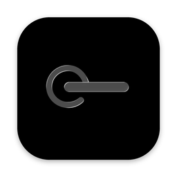
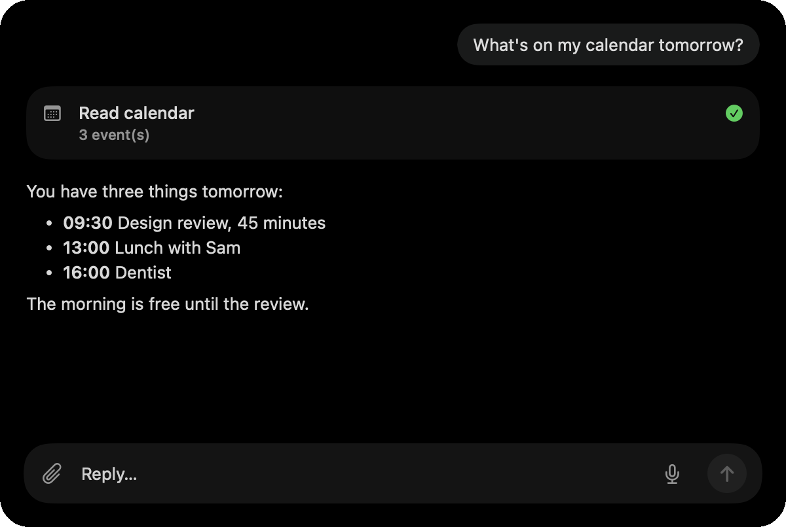
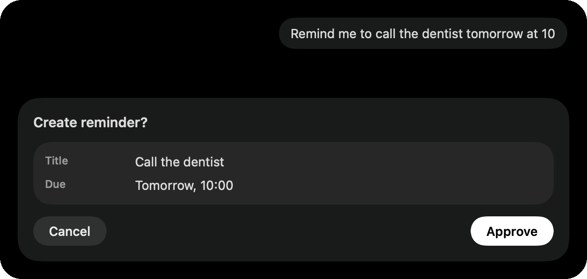
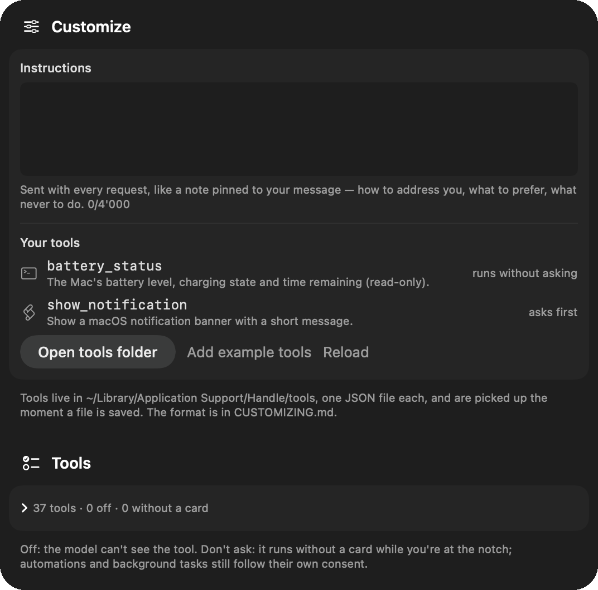

<p align="center"></p>

# Handle

[](https://github.com/dirussu/handle/actions/workflows/build.yml)

A macOS assistant that lives in the notch. It sees your screen, points at and clicks
things, works with your files, calendar, reminders and apps, runs automations on a
schedule or on events, and hands bigger jobs to its own sub-agents. It runs on your own
Anthropic or OpenAI key, and nothing of yours is stored anywhere but this Mac.

Handle is a personal, free, open-source project (MIT). It is not on the App Store and is
not for sale.

<p align="center">
  
  
</p>
<p align="center"><sub>The real interface, rendered with sample content.</sub></p>

## What it does

- **Ask about the screen.** Double-tap ⌥ (or hold ⌥ and talk): Handle captures the screen,
  reads the on-screen elements through Accessibility, and answers. It can also point at the
  thing you asked about and click it when you say so.
- **Do things.** Files, folders, calendar events, reminders, drafts in Mail and Messages,
  Shortcuts, AppleScript, a shell (opt-in), web pages, your MCP connectors. Every
  consequential action shows a card with the exact arguments before it runs; every action
  lands in an audit log.
- **Automations.** "Every weekday at 8, summarize my calendar", "when a PDF appears in
  Downloads, file it". There are time and event triggers, hand-verified recipes for the
  common cases, and agent routines for everything else. Unattended runs are read-only
  unless you grant the automation standing consent.
- **Agents.** The loop can delegate to a sub-agent with a narrowed tool list, or run a
  task in the background and report under the notch. Step caps and dollar budgets are
  visible and editable.
- **Make it yours.** Add tools as JSON files backed by a shell command, AppleScript or a
  Shortcut; pin standing instructions to every request; switch tools off or mark them
  "don't ask"; set each routine's budget. See [CUSTOMIZING.md](docs/CUSTOMIZING.md).

<p align="center"></p>

## Privacy, in one paragraph

Handle is local software. Screen capture, OCR, accessibility, voice transcription
(WhisperKit, on-device), memory, chat history and the audit log stay on your Mac. Only the
model turn goes to the provider you chose, under your own key: that is the conversation,
plus the current screenshot when your question is about the screen. There is no Handle server,
no proxy, no telemetry, and no default provider: you pick one. Every send is visible
(a caption on the bubble, an eye in the notch, a "What was sent" list with cost) and
controllable (apps that are never captured, ask-before-send). Pointing an OpenAI-compatible
endpoint at a local server (LM Studio, Ollama) keeps everything on the machine.

## Requirements

- macOS 26.3 or newer, Apple silicon or Intel; a Mac with a notch is nicest, any Mac works.
- An API key from [Anthropic](https://console.anthropic.com/) or [OpenAI](https://platform.openai.com/),
  or an OpenAI-compatible server. Keys are stored in the macOS Keychain.
- Xcode 26 or newer, only if you build from source.

## Download

Get the disk image from the [latest release](https://github.com/dirussu/handle/releases/latest),
open it, and drag Handle into Applications.

**The first launch needs one extra step.** Handle is a personal project and is not notarized
by Apple (that requires a paid developer account), so macOS blocks it the first time:

1. Open Handle. macOS says it could not verify the app. Click **Done**.
2. Open **System Settings → Privacy & Security**, scroll down to the line saying Handle was
   blocked, click **Open Anyway**, and confirm.
3. Open Handle again and choose **Open**.

If you prefer the terminal, this does the same thing:

```bash
xattr -dr com.apple.quarantine /Applications/Handle.app
```

You do not have to take the download on trust: the complete source is in this repository,
`tools/make_release.sh` produces the same app from it, and each release lists the disk
image's SHA-256.

One consequence of the local signature: after you **update** to a newer version, macOS
treats it as a new app and asks for the permissions again (and may ask once about the
Keychain entry holding your API key).

## Build from source

```bash
git clone https://github.com/dirussu/handle.git
cd handle
open Handle.xcodeproj
```

Select the **Handle** scheme and run (⌘R). Or from the terminal:

```bash
xcodebuild -project Handle.xcodeproj -scheme Handle -configuration Debug -destination 'platform=macOS' build
```

On first launch, onboarding walks you through the permissions Handle needs, one per
screen. It asks for each only when the feature needs it:

| Permission | Used for |
|---|---|
| Screen Recording | the screenshot when you ask about the screen |
| Accessibility | reading on-screen elements, pointing, clicking, typing |
| Microphone | hold-⌥ voice commands (transcribed on-device by WhisperKit) |
| Calendar, Reminders | the calendar and reminder tools |
| Automation (per app) | AppleScript recipes that control a specific app; asked once per app, while you're there |

Then **Settings → AI**: pick a provider, paste your key, choose a model. Nothing is
preselected.

## How it's built

Swift 6 and SwiftUI, one Xcode project, no backend. The interesting parts:

- `Handle/HandleApp.swift`: the agent loop. One `runAgentLoop` serves user turns,
  sub-agents, routines and background tasks; a policy (allowed tools, step cap, budget,
  standing consent, depth) decides what each run may do.
- `Handle/AI/`: the provider layer, with `AnthropicProvider` (Messages API, streaming, prompt
  caching, adaptive thinking), `OpenAIProvider` (Chat Completions, custom base URL),
  `CloudEngine` (turns, usage, "what was sent"), `AgentPrompting`, `AgentPolicy`.
- `Handle/*Tools.swift` and `ToolRegistry.swift`: the built-in tools. `ScreenTools` is the
  hands-and-eyes set, and `UserTools.swift` loads yours.
- `Handle/MCPService.swift`: the MCP client (stdio servers from `mcp.json`, Keychain-backed
  secrets). Their tools join the loop as native tools.
- `Handle/Recipe.swift`: the recipe library (parameterized, hand-verified AppleScript;
  built-ins plus `~/Library/Application Support/Handle/recipes/*.md`), offered to the model
  as `run_recipe`.
- `Handle/Automation.swift`, `TriggerEngine.swift`, `TaskLedger.swift`, `AuditLog.swift`:
  schedules, event triggers, the running-task ledger with a kill switch, and the audit log.

More in [`docs/`](docs): [what Handle is and why](docs/PRODUCT.md), [the model
layer](docs/PROVIDERS.md), [the agent loop and its limits](docs/ASSISTANT.md),
[recipes, automations and triggers](docs/AUTOMATIONS.md), [making it
yours](docs/CUSTOMIZING.md), and the [changelog](docs/CHANGELOG.md).

## Testing

The Debug build includes a self-test suite and a small command hook for driving the app
from the terminal. With Handle running:

```bash
echo "__selftest__" > /tmp/handle_test_cmd
```

Then watch the log:

```bash
/usr/bin/log stream --predicate 'subsystem == "com.dimarussu.Handle"' --level info --style compact
```

`__voicecmd__ <text>` runs a full turn through the loop, `__routinetest__ <goal>` runs a
routine end to end, and `__autoapprove__ on|off` approves confirmation cards automatically
so a test can run through. `tools/` holds test doubles: a fake OpenAI server, a fake MCP
server and a raw-API probe.

## Status and limits

Built and used by one person. Known limits: every file write shows its own card (there is
no "trust this folder" yet), pointing works by element index rather than pixels because
that is more reliable, and web search is Anthropic-only. The OpenAI adapter has been exercised against an OpenAI-compatible test server
(`tools/fake_openai_server.py`), not yet against api.openai.com itself. Bug reports and
ideas are welcome as issues.

## License

[MIT](LICENSE). Copyright (c) 2026 Dmitrii Russu.
